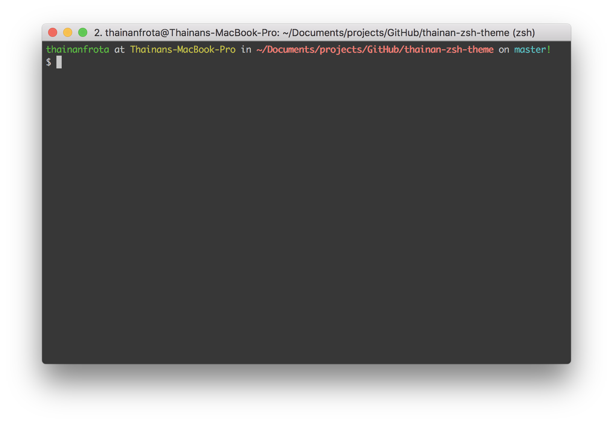

# thainan-zsh-theme



## How to use

1. Clone this repo then copy the `thainan.zsh-theme` file to your `themes` folder into `.oh-my-zsh` directory
2. Update your `.zshrc` (probably at your home folder) and change the `ZSH_THEME` to `thainan`, like this:

```
...
ZSH_THEME="thainan"
...
```

## License

[](http://creativecommons.org/licenses/by/4.0/)

This work is licensed under a [Creative Commons Attribution 4.0 International License](http://creativecommons.org/licenses/by/4.0/).